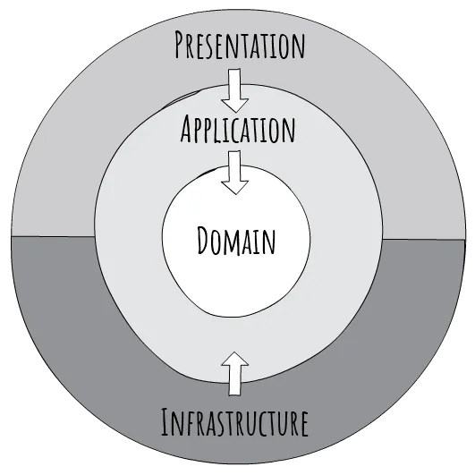

# What Is Clean Architecture?

Clean Architecture is a software design approach that separates concerns and enforces boundaries between different parts of your system

# Why should we use?

As your system grows, tightly coupled code turns small changes into breaking ones. If your domain logic depends on Entity Framework, ASP.NET controllers, or some external API, any refactor can trigger a cascade of unintended side effects.

Clean Architecture flips that dependency flow, infrastructure depends on the core, not the other way around.

# Clean Architecture Principles:

- **Separation of Concerns:** Different concerns (e.g., UI, business logic, data access) are isolated into distinct layers.
- **Platform/Framework Independence:** The core logic of the application does not depend on external frameworks, making it easier to swap frameworks or upgrade them without affecting the core logic.
- **Testability:** Clean Architecture encourages writing unit tests for the business logic independently of external dependencies. This separation allows for efficient and comprehensive testing of the core functionality without requiring integration tests for every minor change.
- **Dependency Rule:** Dependencies should point inward, towards the core of the application. Outer layers depend on inner layers, but inner layers are independent of outer layers.

The flow goes inward: Presentation → Application → Domain

# Separating concerns:

By separating concerns, you give each layer one job:

## Layer: Domain 

The Domain layer should never reference any other projects in your solution. It’s designed to be completely independent of frameworks, databases, and user interfaces. This ensures that the core of your application remains isolated and free from any unnecessary dependencies, making it easier to maintain and evolve over time.

It knows nothing about EF Core, HTTP, or even that it’s running in a web app. It’s 100% pure C#, and that’s the point.

<pre>
📁 Domain
├── 📁 Entities
├── 📁 Enums
├── 📁 Constants
└── 📁 ValueObjects
</pre>

### Value Objects vs Entities (business objects with rules)

Reduced to the essential distinction, identity matters for entities, but does not matter for value objects. For example, someone's Name is a value object. A Customer entity might be composed of a customer Name (value object), List<Order> OrderHistory (List of entities), and perhaps a default Address (typically a value object). The Customer Entity would have an ID, and each order would have an ID, but a Name should not; generally, within the object model anyway, the identity of an Address probably does not matter.

Value objects can typically be represented as immutable objects; changing one property of a value object essentially destroys the old object and creates a new one, because you're not as concerned with identity as with content. Properly, the Equals instance method on Name would return "true" as long as the object's properties are identical to the properties of another instance.

However, changing some attribute of an entity like Customer doesn't destroy the customer; a Customer entity is typically mutable. The identity remains the same (at least once the object has been persisted).

You probably create value objects without realizing it; anytime you are representing some aspect of an Entity by creating a fine-grained class, you've got a value object. For example, a class IPAddress, which has some constraints on valid values but is composed of simpler datatypes, would be a value object. An EmailAddress could be a string, or it could be a value object with its own set of behaviors.

It's quite possible that even items that have an identity in your database don't have an identity in your object model. But the simplest case is a composite of some attributes that make sense together. You probably don't want to have Customer.FirstName, Customer.LastName, Customer.MiddleInitial and Customer.Title when you can compose those together as Customer.Name; they'll probably be multiple fields in your database by the time you think about persistence, but your object model doesn't care.

## Layer: Application

It coordinates actions using the domain. Think of it as the place where you define what the system should do, without worrying how it does it.

The Services in Application layer will implement the use cases (Use cases are a specific type of business rule designed to be executed as a flow within an automated system).
Example: 
<pre>
Logic: When a new user is created, save it and notify admin users.
Does it create a new user in a SQL database? Does it notify admin users using a Queue? For the application layer, the details of how to do it, it doesn't matter.
</pre>

<pre>
📁 Application
├── 📁 Interfaces
    ├── 📁 Repositories
    ├── 📁 Services
├──  📁 DTOs
└──  📁 Services
</pre>

## Layer: Infrastructure

This layer implements the Repository abstractions/Interfaces defined in the Application layer.

The infrastructure layer handles the communication with the outer world. Examples: Email providers, External API integrations, Database, Message queues and etc.

It depends on Application and Domain, but they don’t depend on it. This keeps your core logic clean and testable.

<pre>
📁 Infra
├── 📁 Infra.IoC
├── 📁 Infra.Database
    ├── 📁 Repositories
    ├── 📁 Data
└── 📁 Infra.Client
    ├── 📁 HttpClients
    └── 📁 Data
</pre>

### IoC

Dependency Injection (DI) is used to provide dependencies to a Layer. Example: Provide Infra repository implementations to Application layer. This promotes decoupling and makes the components easier to test. It uses Dependency Inversion Principle.

#### Dependency Inversion Principle

High levels of modules should not be dependent on low levels of modules. Both should follow abstractions (e.g., interfaces).

### Anti-Corruption Layer (ACL) Pattern

The Anti-Corruption Layer (ACL) is a design pattern that helps maintain the integrity of your domain model when interacting with external systems. It acts as a translator between your clean system and the “corrupt” (or differently structured) external system

Instead of letting external APIs, databases, or services infect your internal architecture, ACL ensures:
- **Data transformation:** Converts external data formats into a structure that fits your domain model.
- **Business logic mapping:** Filters out unnecessary complexity and aligns rules with your application.
- **Prevents breaking changes:** Keeps business logic isolated from external inconsistencies

Example:
<pre>
Response from endpoint is corrupted:
- Different property name (trx_id vs PaymentId)
- Amount as a string instead of a decimal

{
  "trx_id": "ABC123",
  "payment_total": "100.50",
  "curr": "USD",
  "state": "success"
}
</pre>

## Layer: Presentation

This is how users or clients interact with your app.

It receives input, calls the Application layer, and returns output. No business rules here, just translation between the outside world and your system.

The presentation is interchangeable. You should be able to switch to another presentation such as an android, iOS, web single-page application or desktop application without altering the rest of the app.

<pre>
📁 Presentation
├── 📁 Controllers
├── 📁 Middlewares
└── 📁 Extensions
</pre>